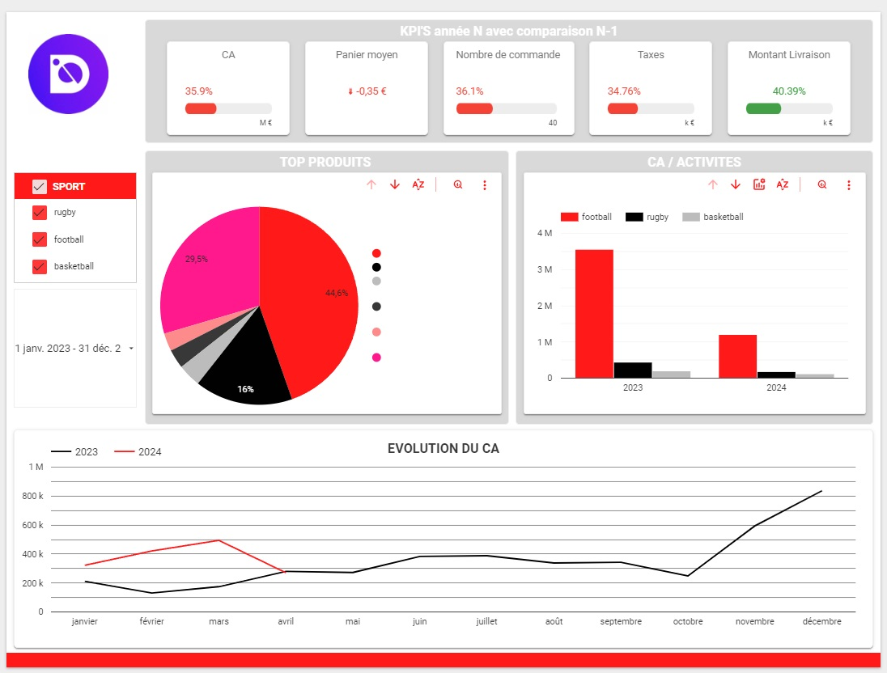
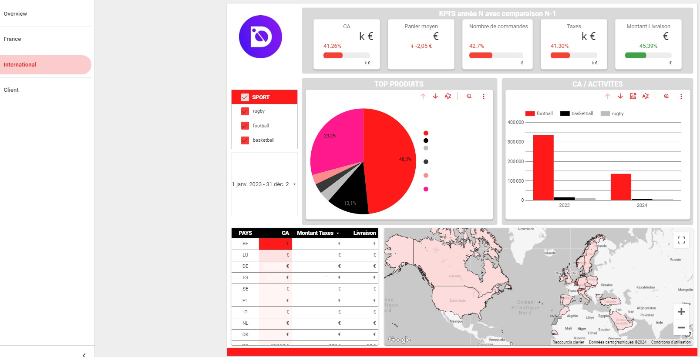
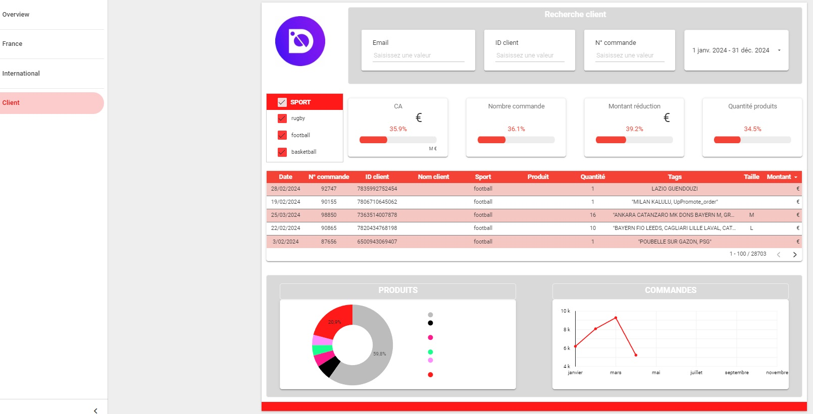
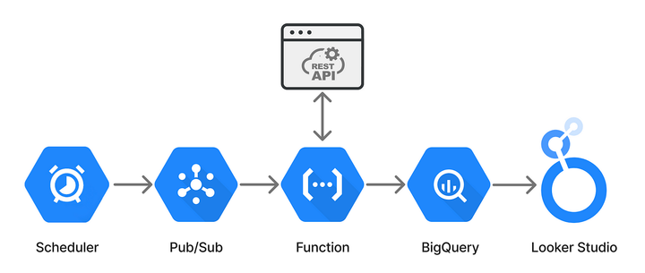

### unbonmaillot.com E-commerce Data Integration Project

#### Context
unbonmaillot.com, a leading e-commerce platform for sports merchandise, sought to enhance its data management and visualization capabilities by integrating automated data extraction, processing, and analysis using Google Cloud and Looker Studio.

#### Project Objectives
- **Data Extraction**: Develop a Python script to extract data via the Shopify API.
- **Data Cleaning and Processing**: Ensure the extracted data is clean and ready for analysis.
- **Data Upload**: Automate the process of uploading data to Google BigQuery.
- **Visualization**: Update Looker Studio dashboards with the latest data for real-time insights.

#### Methods
- **Web Crawling & API Integration**: Automated data extraction from Shopify using Python scripts.
- **Data Cleaning**: Utilizing Pandas and Numpy for data cleaning and processing.
- **Cloud Integration**: Employing Google Cloud Platform (GCP) services for seamless data transfer and storage.
- **Visualization**: Using Looker Studio to create dynamic and interactive dashboards.

#### Visualizations
The Looker Studio dashboards provide comprehensive insights into key performance metrics, product performance, and geographical sales distribution. Below are some examples of the dashboards created:

- **KPI Dashboard**:
  
  
- **Geographical Sales Dashboard**:
  
  
- **Customer Insights Dashboard**:
  

#### Automation Process
The automation process leverages various GCP services to ensure seamless data flow from extraction to visualization:

#### Notebooks and Scripts
- `shopify_data_pipeline.py`: Contains the Python script for data extraction, cleaning, processing, and uploading to BigQuery.

#### Dependencies
- **Python Packages**:
  - Pandas
  - Numpy
  - Requests
  - Google Cloud BigQuery

#### Results
- **Client Satisfaction**: The client is highly satisfied with the results, leading to an internal deployment of the solution within their processes.
- **Improved Efficiency**: The automated process significantly reduces manual intervention, ensuring timely updates and accurate data for decision-making.

#### Future Enhancements Possibilities
- **Scalability**: Enhancing the script to handle larger datasets and more complex queries.
- **Advanced Analytics**: Integrating machine learning models for predictive analytics and deeper insights.

This project demonstrates the power of combining data engineering and cloud technologies to streamline e-commerce operations and provide valuable business insights.